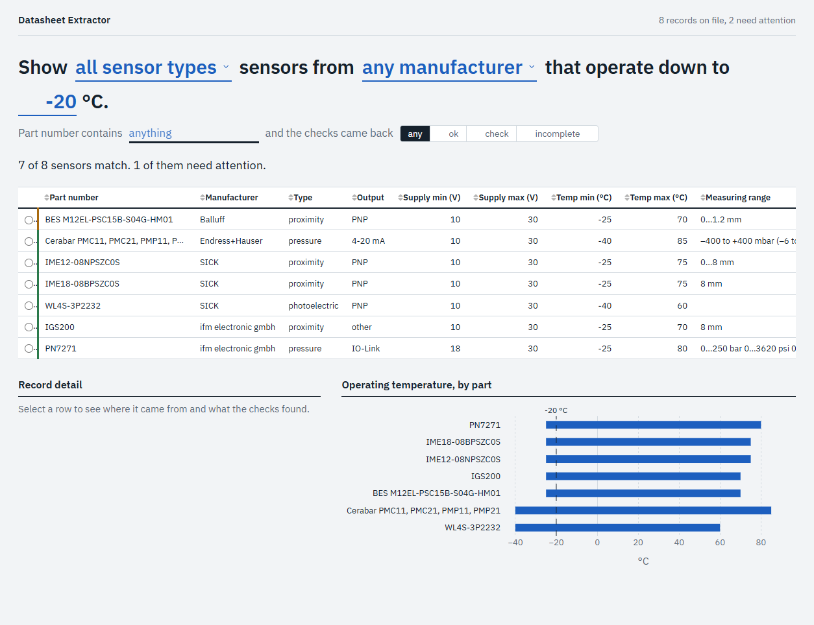

# Datasheet Extractor


Machine builders keep hundreds of component datasheets as PDFs, and nothing in
them can be searched or compared. This tool reads those PDFs, pulls out a fixed
set of specifications, checks them, and shows the result in a table you can
filter, so a question like "which of our sensors work below -20 °C" takes one
click instead of an afternoon.



## Run it

You need Python 3.12 and a free Google AI Studio key. Copy `.env.example` to
`.env` and paste the key after `GOOGLE_API_KEY=`. Then, from the project folder:

```bash
pip install -r requirements.txt
```

```bash
python -m datasheet_extractor.pipeline datasheets/
```

```bash
python -m datasheet_extractor.dashboard
```

The first command installs the three libraries the tool uses. The second reads
every PDF in the `datasheets` folder and writes what it finds to
`datasheets.db`, printing one line per file. The third opens the dashboard at
http://127.0.0.1:8050. Run the second command again whenever you add PDFs;
files it has already seen are skipped for free.

## How it works

Each PDF passes through four small components, each with one job:

1. **Loader** turns the PDF into plain text, one string per page. A PDF with
   no text layer, which usually means a scanned image, is reported as skipped.
2. **Extractor** sends the text to a language model with a list of the fields
   to find, and turns the reply into a dictionary. Before sending, a small
   page-selection step keeps only the pages that look like specification
   tables and caps the total size, because most of a datasheet is marketing
   copy and drawings and the free tier is rate-limited. Note that this step
   sends the selected text to Google's API, so do not run it on confidential
   documents unless that is acceptable to you.
3. **Validator** checks the dictionary: required fields present, units
   converted to one canonical unit per field (°F to °C, kg to g), values
   inside a plausible range, and enum and pattern rules. Anything wrong is
   recorded as a problem with a plain-language message. Suspicious values are
   flagged, not thrown away.
4. **Store** writes the result to a SQLite database with duplicate handling,
   so a revised datasheet updates its record and a reprocessed file never
   creates a second one.

The list of fields lives in one JSON file, [schemas/sensor.json](schemas/sensor.json).
It drives the prompt, the parsing and the validation, so adding a field is a
one-line change. Motors and bearings would each get their own schema file.

The dashboard reads only from the database. It never touches PDFs or the
model, so it can be opened while the pipeline is running.

**The model is pluggable.** The extractor talks to a one-method interface,
`LLMClient`, and the shipped implementation uses Google Gemini. Supporting
another provider means writing one small class; nothing else changes. The
model name can be overridden with the `GEMINI_MODEL` environment variable.

## Limitations

- **Scanned PDFs are skipped.** There is no OCR. A datasheet whose pages are
  images is recorded as skipped with a reason, and shows up nowhere else.
- **Page selection is a keyword heuristic and can miss.** It keeps pages
  containing phrases like "technical data" or "operating voltage", up to a
  character cap. A long datasheet with unusual wording, or with the
  specifications beyond the cap, comes back with most fields missing. In
  testing, a 20-page temperature transmitter datasheet lost its voltage and
  temperature fields this way. Such records are stored with errors so they
  are visible, not silently dropped.
- **Multi-product datasheets confuse the part number.** A sheet covering a
  whole product family yields one record, and the model may pick one variant
  or list several in the part-number field.
- **Measuring range is stored as text**, not numbers, because its unit
  depends on the sensor type (bar, mm, °C). You can read and search it but not
  filter it numerically.
- **The model can be wrong.** Extraction is a language-model reading text, and
  it occasionally misreads a table or reports a value from the wrong column.
  The validator catches impossible values, not plausible wrong ones. Treat
  the output as a starting point and check anything that matters.
- **The free tier is small.** At the time of writing, Google's free tier
  allows about 20 requests per day per model, so roughly 20 new datasheets a
  day. The pipeline stops early when the quota is hit and picks up where it
  left off on the next run.

## Development

```bash
pip install -r requirements.txt -r requirements-dev.txt
```

```bash
pytest
```

The suite has 27 tests and runs offline in well under a second. The model is
replaced by a fake client that returns scripted replies, so no API key or
network is needed, and the same suite runs in GitHub Actions on every push.
The two fixture PDFs under `tests/fixtures` are built by a standard-library
script so they can be regenerated anywhere.

## License

MIT, see [LICENSE](LICENSE).
